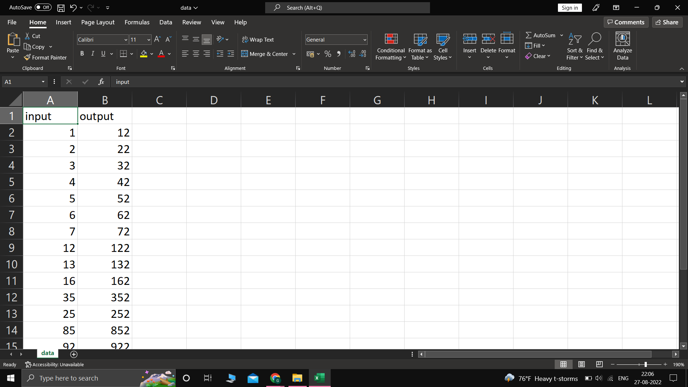

# Developing a Neural Network Regression Model

## AIM

To develop a neural network regression model for the given dataset.

## THEORY

### Neural Networks
Neural networks are a set of algorithms, modeled loosely after the human brain, that are designed to recognize patterns. They interpret sensory data through a kind of machine perception, labeling or clustering raw input. The patterns they recognize are numerical, contained in vectors, into which all real-world data, be it images, sound, text or time series, must be translated.

### Regression model
A regression model provides a function that describes the relationship between one or more independent variables and a response, dependent, or target variable. For example, the relationship between height and weight may be described by a linear regression mode.
## Neural Network Model

## DESIGN STEPS

### STEP 1:

Loading the dataset

### STEP 2:

Split the dataset into training and testing

### STEP 3:

Create MinMaxScalar objects ,fit the model and transform the data.

### STEP 4:

Build the Neural Network Model and compile the model.

### STEP 5:

Train the model with the training data.

### STEP 6:

Plot the performance plot

### STEP 7:

Evaluate the model with the testing data.

## PROGRAM

(https://github.com/GaneshK567/basic-nn-model/blob/47afbad0d70da3d540dfc037554bfac85f1b7fea/NNTraining.ipynb)

## Dataset Information

## OUTPUT

### Training Loss Vs Iteration Plot

### Test Data Root Mean Squared Error

0.05628426373004913

### New Sample Data Prediction

## RESULT

Succesfully created and trained a neural network regression model for the given dataset.

